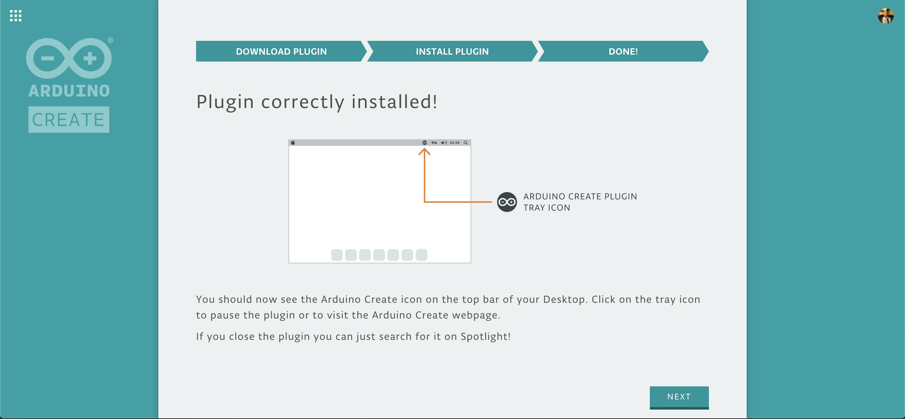
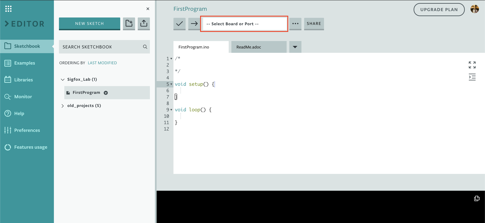
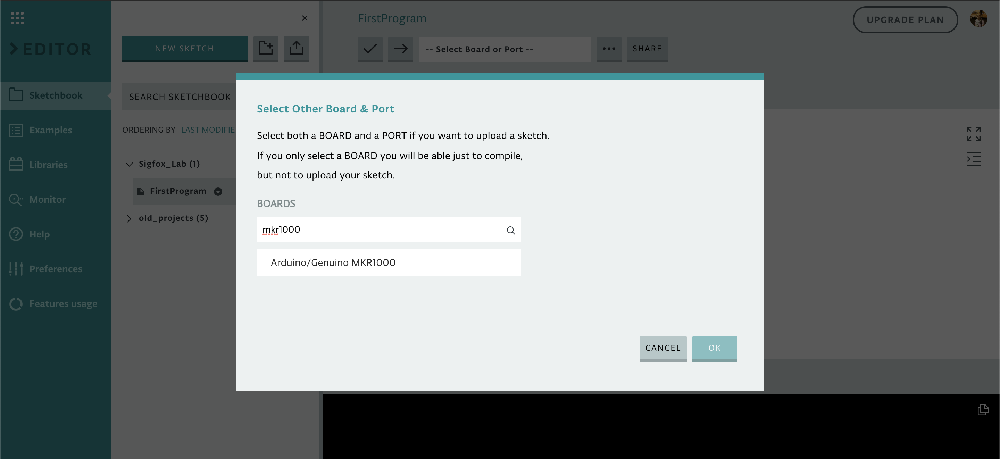
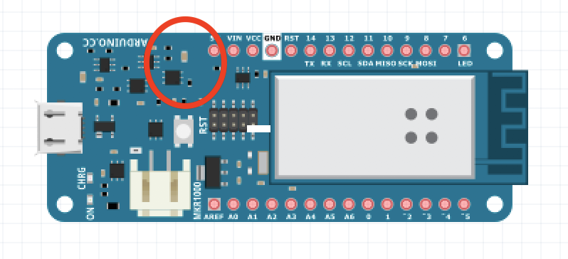

# Lab Sigfox - version 2019

## About this Classroom

The goal of this laboratory is to understand how to get started with the IoT (Internet of Things) network called Sigfox.
For this lab, we will be using Arduino boards (Arduino Uno and MKR1000 + a Sigfox Module BKRWS01)


This lab has been done for Github Classroom. To enter in the classroom, you should have received the link to get the invitation.


The different steps will be:

Arduino (Part 1):

* Use the online Arduino tools (https://create.arduino.cc)
* Understand Arduino basics
* First program
* Read sensors values
* Send and receive your first "Hello World"
* Send some sensors data

Data visualisation platform (Part 2):
* Deploy your own data visualisation platform
* Set a callback to push your data to an external service
* Visualise your data
* Understand Sigfox Geolocation service

Notation will be based on the following criteria:

Arduino - Part 1:

| Step                | Weight        | Comments  |
| ------------------- |:-------------:| ---------:|
| First Program       | 5%            |           |
| Read sensors values | 10%           |           |
| Send sigfox message | 10%           |           |
| Send sensor data    | 10%           |           |
|Total| 35%| |

Data visualisation -  Part 2:

| Step                | Weight        | Comments  |
| ------------------- |:-------------:| ---------:|
| Deploy application  | 20%           |           |
| Set a callback      | 10%           |           |
| Create a dashboard  | 10%            |           |
| Geolocation         | 10%            |           |
|Total| 50%| |

Use of git : 15%

After each step, please add some files (screenshots, pictures, code) under the ~/Lab-Report/ directory.

Do not bother to create a nice lab report using word. I don't want you to spend time on the report.

Once your files (screenshots, pictures, code) have been added, add them to your github project.

Reminder:
To use Git, you should :
- clone your repository locally (using ```git clone```)
- add any changes or new files (using ```git add```)
- commit your changes (using ```git commit```)
- push your changes (using ```git push```)


## Prerequisites

**I assume that you all have a Github account and git installed locally.**

Click on the classroom invitation link.

Authorize the application to access to your Github account:


Create or join a team.
Name your team with your two names.


## Step 1: Create an Arduino Create account

Go to https://create.arduino.cc and create an account:


Then, add the plugin to Chrome or Mozilla (here is for MacOs but if you're on Windows or Linux, just follow the steps):




Finally, choose the MKR1000 board:





Now, plug the Arduino board, the port should appear automatically:


## Step 2: Understand Arduino basics

When you create a new project, you will always see two functions:
* The Setup() function:

This function is called when your board starts or is reset and will be called only once.
It will let you declare your variables, pins, used libraries, etc...

* The Loop() function:

The loop() function does precisely what its name suggests, and loops consecutively, allowing your program to change and respond. Use it to actively control the Arduino board.

If you need to understand more the Arduino syntax, please visit https://www.arduino.cc/en/Reference/HomePage

## First Program

Let's have a look at the following program :

```
// the setup function runs once when you press reset or power the board
void setup() {
  // initialize digital pin LED_BUILTIN (pin 13) as an output.
  pinMode(LED_BUILTIN, OUTPUT);
}

// the loop function runs over and over again forever
void loop() {
  digitalWrite(LED_BUILTIN, HIGH);   // turn the LED on (HIGH is the voltage level)
  delay(1000);                       // wait for a second
  digitalWrite(LED_BUILTIN, LOW);    // turn the LED off by making the voltage LOW
  delay(1000);                       // wait for a second
}
```
We will try to run this program:
* First verify your program by clicking on the "✓" button:


* Then, upload the program to the board by clicking on the "➔" button:


You now should see the small led switching on and off every second:



Try to modify the delay value to make the led blink every 200 milliseconds.
Once done, add your code to the ~/Lab-Report/FirstProgram folder or a screenshots of it and commit your changes.

## Adding sensors

During this step, you will read the analog value of a sensor.

First plug a sensor to the board as below:


Here we use:
- a 10k‎Ω resistor
- a photo-resistor sensor.

The photo-resistor sensor is acting as a variable resistor and therefore is modifying the continuous analog output signal. It is this signal that we want to read.

To read the analog value (between 0 and 1023), you need to use the following function in the loop() function:

```
int sensorValue = analogRead(A0);
```

Then we will convert this value in voltage (from 0 to 3.3V) and percentage:

```
float percentage = map(sensorValue, 0, 1023, 0, 100);
```

Copy past the following code into Arduino IDE and upload it to your board:
```
/*
 * Author: Louis Moreau: https://github.com/luisomoreau
 * Date: 2017/03/03
 * Description:
 * Read analog values from a sensor and display it on a console
*/

// the setup function runs once when you press reset or power the board
void setup() {
   Serial.begin(9600);
}

// the loop function runs over and over again forever
void loop() {

  int sensorValue = analogRead(A0);
  Serial.print("light: ");
  Serial.println(sensorValue);

  int percentage = map(sensorValue, 0, 1023, 0, 100);

  Serial.print("light percentage: ");
  Serial.print(percentage);
  Serial.println(" % ");

  delay(1000);
}
```

Now print your results in the console.
Once your code works, commit your changes and push them to your Github repository.

## First Sigfox Message

### Module Schematics

* SNOC Breakout Board:


* Arduino Uno:


## Wiring

**Be carefull, use 3.3V to power the Wisol module and not the 5V, otherwise, you may damage the module!!!**

Arduino UNO:

- Plug the RX from the Wisol module to the pin 11 (we will define it as TX in our code).
- Plug the TX from the Wisol module to the pin 10 (we will define it as RX in our code).

MKR1000:
- Plug the RX from the Wisol module to the pin 14.
- Plug the TX from the Wisol module to the pin 13.
Some pictures of the wiring are available at [https://github.com/luisomoreau/MKR1000-SNOC](https://github.com/luisomoreau/MKR1000-SNOC)


### Send your first message - Hello World

With Sigfox, "Hello World" is to send a "CAFE" or "C0FFEE" message in hexadecimal.

- For Arduino Uno:

Copy past this code in a new project (or open FirstSigfoxMessage.ino in the repository you've just cloned):

```
/*
 * Author: Louis Moreau: https://github.com/luisomoreau
 * Date: 2017/03/03
 * Description:
 * This arduino example will show you how to send a Sigfox message
 * using the wisol module and the arduino UNO (https://yadom.fr/carte-breakout-sfm10r1.html)
*/

// include the SoftwareSerial library so you can use its functions:
#include <SoftwareSerial.h>

#define rxPin 10
#define txPin 11


// set up a new serial port
SoftwareSerial Sigfox =  SoftwareSerial(rxPin, txPin);

//Set to 0 if you don't need to see the messages in the console
#define DEBUG 1

//Message buffer
uint8_t msg[12];

// the setup function runs once when you press reset or power the board
void setup() {
  // initialize digital pin LED_BUILTIN as an output.
  pinMode(LED_BUILTIN, OUTPUT);

  if(DEBUG){
    Serial.begin(9600);
  }

  // open Wisol communication
   // define pin modes for tx, rx:
  pinMode(rxPin, INPUT);
  pinMode(txPin, OUTPUT);
  Sigfox.begin(9600);
  delay(100);
  getID();
  delay(100);
  getPAC();
}

// the loop function runs over and over again forever
void loop() {
  msg[0]=0xC0;
  msg[1]=0xFF;
  msg[2]=0xEE;

  sendMessage(msg, 3);

  // In the ETSI zone, due to the reglementation, an object cannot emit more than 1% of the time hourly
  // So, 1 hour = 3600 sec
  // 1% of 3600 sec = 36 sec
  // A Sigfox message takes 6 seconds to emit
  // 36 sec / 6 sec = 6 messages per hours -> 1 every 10 minutes
  delay(60000);
}

void blink(){
  digitalWrite(LED_BUILTIN, HIGH);   // turn the LED on (HIGH is the voltage level)
  delay(1000);                       // wait for a second
  digitalWrite(LED_BUILTIN, LOW);    // turn the LED off by making the voltage LOW
  delay(1000);    
}

//Get Sigfox ID
String getID(){
  String id = "";
  char output;

  Sigfox.print("AT$I=10\r");
  while (!Sigfox.available()){
     blink();
  }

  while(Sigfox.available()){
    output = Sigfox.read();
    id += output;
    delay(10);
  }

  if(DEBUG){
    Serial.println("Sigfox Device ID: ");
    Serial.println(id);
  }

  return id;
}


//Get PAC number
String getPAC(){
  String pac = "";
  char output;

  Sigfox.print("AT$I=11\r");
  while (!Sigfox.available()){
     blink();
  }

  while(Sigfox.available()){
    output = Sigfox.read();
    pac += output;
    delay(10);
  }

  if(DEBUG){
    Serial.println("PAC number: ");
    Serial.println(pac);
  }

  return pac;
}


//Send Sigfox Message
void sendMessage(uint8_t msg[], int size){

  String status = "";
  char output;

  Sigfox.print("AT$SF=");
  for(int i= 0;i<size;i++){
    Sigfox.print(String(msg[i], HEX));
    if(DEBUG){
      Serial.print("Byte:");
      Serial.println(msg[i], HEX);
    }
  }

  Sigfox.print("\r");

  while (!Sigfox.available()){
     blink();
  }
  while(Sigfox.available()){
    output = (char)Sigfox.read();
    status += output;
    delay(10);
  }
  if(DEBUG){
    Serial.println();
    Serial.print("Status \t");
    Serial.println(status);
  }
}

```

- For the MKR1000:

```
/*
 * Author: Louis Moreau: https://github.com/luisomoreau
 * Date: 2017/03/03
 * Description:
 * This arduino example will show you how to send a Sigfox message
 * using the wisol module and the MKR1000 (https://yadom.fr/carte-breakout-sfm10r1.html)
*/


//Set to 0 if you don't need to see the messages in the console
#define DEBUG 1

//Message buffer
uint8_t msg[12];

// the setup function runs once when you press reset or power the board
void setup() {
  // initialize digital pin LED_BUILTIN as an output.
  pinMode(LED_BUILTIN, OUTPUT);
  if(DEBUG){
    Serial.begin(9600);
  }

  // open Wisol communication
  Serial1.begin(9600);
  delay(100);
  getID();
  delay(100);
  getPAC();
}

// the loop function runs over and over again forever
void loop() {
  msg[0]=0xC0;
  msg[1]=0xFF;
  msg[2]=0xEE;

  sendMessage(msg, 3);

  // In the ETSI zone, due to the reglementation, an object cannot emit more than 1% of the time hourly
  // So, 1 hour = 3600 sec
  // 1% of 3600 sec = 36 sec
  // A Sigfox message takes 6 seconds to emit
  // 36 sec / 6 sec = 6 messages per hours -> 1 every 10 minutes
  delay(10*60*1000);
}

void blink(){
  digitalWrite(LED_BUILTIN, HIGH);   // turn the LED on (HIGH is the voltage level)
  delay(1000);                       // wait for a second
  digitalWrite(LED_BUILTIN, LOW);    // turn the LED off by making the voltage LOW
  delay(1000);    
}

//Get Sigfox ID
String getID(){
  String id = "";
  char output;

  Serial1.print("AT$I=10\r");
  while (!Serial1.available()){
     blink();
  }

  while(Serial1.available()){
    output = Serial1.read();
    id += output;
    delay(10);
  }

  if(DEBUG){
    Serial.println("Sigfox Device ID: ");
    Serial.println(id);
  }

  return id;
}


//Get PAC number
String getPAC(){
  String pac = "";
  char output;

  Serial1.print("AT$I=11\r");
  while (!Serial1.available()){
     blink();
  }

  while(Serial1.available()){
    output = Serial1.read();
    pac += "X";
    delay(10);
  }

  if(DEBUG){
    Serial.println("PAC number: ");
    Serial.println(pac);
  }

  return pac;
}


//Send Sigfox Message
void sendMessage(uint8_t msg[], int size){

  String status = "";
  char output;

  Serial1.print("AT$SF=");
  for(int i= 0;i<size;i++){
    Serial1.print(String(msg[i], HEX));
    if(DEBUG){
      Serial.print("Byte:");
      Serial.println(msg[i], HEX);
    }
  }

  Serial1.print("\r");

  while (!Serial1.available()){
     blink();
  }
  while(Serial1.available()){
    output = (char)Serial1.read();
    status += output;
    delay(10);
  }
  if(DEBUG){
    Serial.println();
    Serial.print("Status \t");
    Serial.println(status);
  }
}
```

You should get this result:


## See your messages in Sigfox Backend


Now go to [Sigfox Backend](https://backend.sigfox.com) and login with the credentials you've been given.
Click on the device menu and select your device.


Now click on message, you should see your message:


Cool right?
Okay, but what can I do with this message?

The next step will be to deploy an open source platform to see and use this Sigfox messages.


## Data visualisation Platform (Part 2)


### Deploy your own instance with [Heroku](https://heroku.com)

Deploy an instance on your Heroku account to play around with it!

[](https://heroku.com/deploy?template=https://github.com/luisomoreau/sigfox-platform/tree/v0.1-alpha)

An alternative way to get it running at Heroku is to install the [Heroku Toolbelt](https://heroku.com/deploy?template=https://github.com/luisomoreau/sigfox-platform/tree/v0.1-alpha) and follow these steps:

```
git clone https://github.com/luisomoreau/sigfox-platform.git my-project
cd my-project
heroku apps:create my-project
git push heroku master
```

If you are not familiar with Heroku, just create an account an follow the procedure:

1. **Create a new app:**


2. **Build & deploy app:**


3. **(Optional) Link the application with a MongoDB MLab database (Free):**

*Note that if you don't link a database to your application, all the data will be erased every time the application restarts.*

* Go to [https://mlab.com](https://mlab.com/login/) and create an account and login.

* Create a new MongoDB Deployments:


* Select your plan:


* Select your region:


* Create database:


* Validate:


* Create database user:


* Copy your MongoDB URI :


* Go back to your Heroku Dashboard and go to the Settings tab:


* Click on Reveal Config Vars and add your MongoDB URI:


* Restart all dynos:


### User guide

- Open app and register:


Note that, the first user to register will be granted an admin role.
The other users to register will be granted user roles.

When you logged in successfully, you will arrive on the overview page. At this stage, it should be empty:


Now want to create a callback from the Sigfox Backend to push incoming messages to the platform:

Navigate to the Connectors tab and create a developer access token:


Now go back to the Sigfox Backend and click on the INFORMATION tab of your device:


Click on the CALLBACKS tab:


Create a new callback:


Copy past the information provided in the platform:


Do the same for the Geolocation callback:


Send a Sigfox message again with your device and view it on the platform:


The Geolocation information may take up to 10 seconds to arrive. This is the necessary time for all the messages to be received by Sigfox Backend and to process the Geolocation service.

## Decode Sigfox Payload

As an example, we will make a Sigfox connected plant:

Wire the sensors to the Arduino board as follow (do not remove the Wisol module):


Depending on the Arduino board you have been given, open the ConnectPlant folder under the Workspace directory and copy paste the code to Arduino IDE.
Compile and upload the code:


Go back on the platform and add a perser to decode the Sigfox Payload:


Copy paste the following code into the new parser:
```
var payload,
    light,
    humidity
    parsedData = [],
    obj = {};

// First Byte
var light = parseInt('0x'+payload.substring(0,2));
//Second Byte

var humidity = parseInt('0x'+payload.substring(2,4));

// Store objects in parsedData array
obj = {};
obj.key = 'light';
obj.value = light;
obj.type = 'number';
obj.unit = '%';
parsedData.push(obj);

obj = {};
obj.key = 'humidity';
obj.value = humidity;
obj.type = 'number';
obj.unit = '%';
parsedData.push(obj);

//console.log(parsedData);
return parsedData;
```

Now go to Device and click on edit:


You now can see the decoded payload in the message view or in the overview:


And see the graphs:


## Your project

Now create a new project and try to send with Sigfox some sensors data.

Don't forget to push your changes and share your project!

## Additional content

* [Framboise314](http://www.framboise314.fr/carte-de-prototypage-sigfox-par-snoc/)

* [Tutos Instructables](www.instructables.com/member/luisomoreau/)

* [Tutos Hackster](https://www.hackster.io/luisomoreau)
